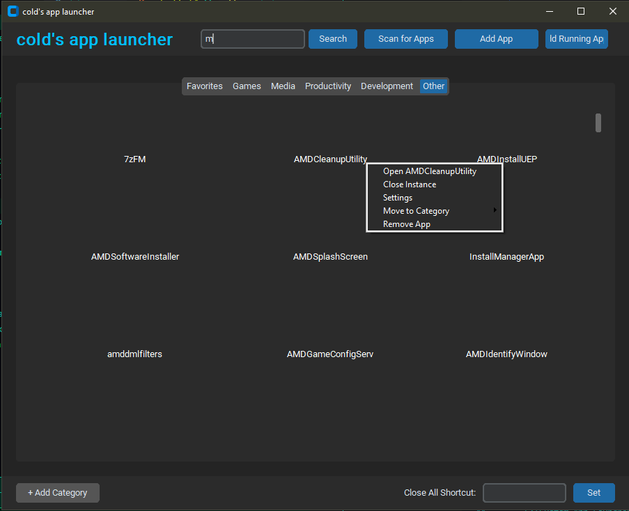
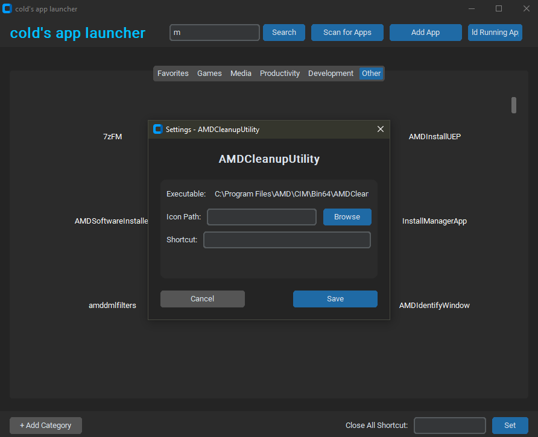

# cold's app launcher - Boost Your Multitasking Efficiency



I was constantly struggling to manage multiple applications, which was affecting my productivity. To optimize my workflow, I created the **cold's app launcher**. This tool has become my central hub for launching, organizing, and managing applications efficiently. Now, I'm sharing it with you to help streamline your workflow and boost your productivity. Say goodbye to cluttered desktops and endless searching through menus!

## Key Features for Enhanced Productivity:

*   **Centralized App Launching:** Access all your applications from a single, sleek interface. No more desktop icon jungles or digging through the Start Menu.
*   **Categorization for Organization:** Group your applications into logical categories like "Favorites," "Games," "Productivity," and more.  Create custom categories to perfectly match your workflow.  Easily navigate through your applications with organized tabs.
*   **Powerful Search:** Instantly find any application by name using the integrated search bar. Just type a few letters, and the app you need is at your fingertips.
*   **Customizable Shortcuts:** Assign global keyboard shortcuts to your frequently used applications for lightning-fast access. Open your favorite tools with a simple key combination, no matter what you're doing.
*   **App-Specific Settings:** Tailor each application's experience with custom icons and dedicated shortcuts through the app settings menu.



## Why Choose cold's app launcher?

*   **Efficiency:** Launch applications faster and switch between tasks seamlessly, saving you valuable time.
*   **Organization:** Keep your digital workspace clean and organized, reducing distractions and improving focus.
*   **Customization:** Personalize your app launcher to fit your unique needs and preferences with categories, icons, and shortcuts.
*   **Modern & Intuitive Interface:** Enjoy a clean, dark-themed, and easy-to-use interface powered by `customtkinter`, making app management a breeze.
*   **System Tray Integration:** Minimize the app to the system tray for unobtrusive background operation, always ready when you need it.

## Getting Started:

1.  **Installation:**  Ensure you have Python installed (preferably Python 3.8 or higher) along with the required libraries (`tkinter`, `subprocess`, `keyboard`, `json`, `os`, `sys`, `pystray`, `pillow`, `customtkinter`, `psutil`). You can install them using pip:
    ```bash
    pip install customtkinter pystray pillow keyboard psutil
    ```
2.  **Running the Application:** Simply run the Python script (e.g., `app_manager.py`).
3.  **Scanning for Apps:** Use the "Scan for Apps" button to automatically detect applications on your system.
4.  **Adding Apps Manually:**  Use "Add App" to select individual executables or "Add Running Apps" to include applications currently running.
5.  **Organizing Categories:**  Navigate through default categories or create new ones using the "+ Add Category" button at the bottom.
6.  **Customizing Apps:** Right-click on any app button to access the "Settings" menu and customize its icon and shortcut.
7.  **Using Search:** Type in the search bar at the top right to quickly filter applications in the current category.

## Effecient Multitasking at Your Fingertips

The **cold's app launcher** is more than just an app launcher; it's your personal command center for managing your digital tools. By streamlining app access and organization, it empowers you to **multitask more efficiently**, boost your productivity, and enjoy a cleaner, more focused computing experience.

---

**Images:**

*   **feature\_overview.png:**  Should showcase the main application window, highlighting the search bar, category tabs (e.g., "Favorites," "Games," "Productivity"), and app buttons within a category.
*   **app\_settings.png:** Should display the "Settings" dialog for an application, clearly showing the options for "Icon Path" and "Shortcut."

**Note:**  Make sure to place `feature_overview.png` and `app_settings.png` in the same directory as your `README.md` file for the image links to work correctly in Markdown viewers.

---